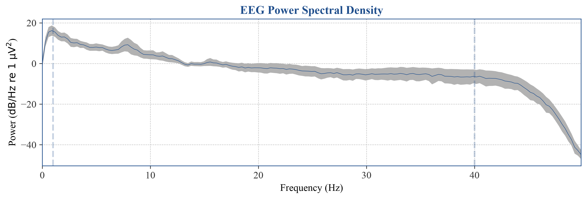
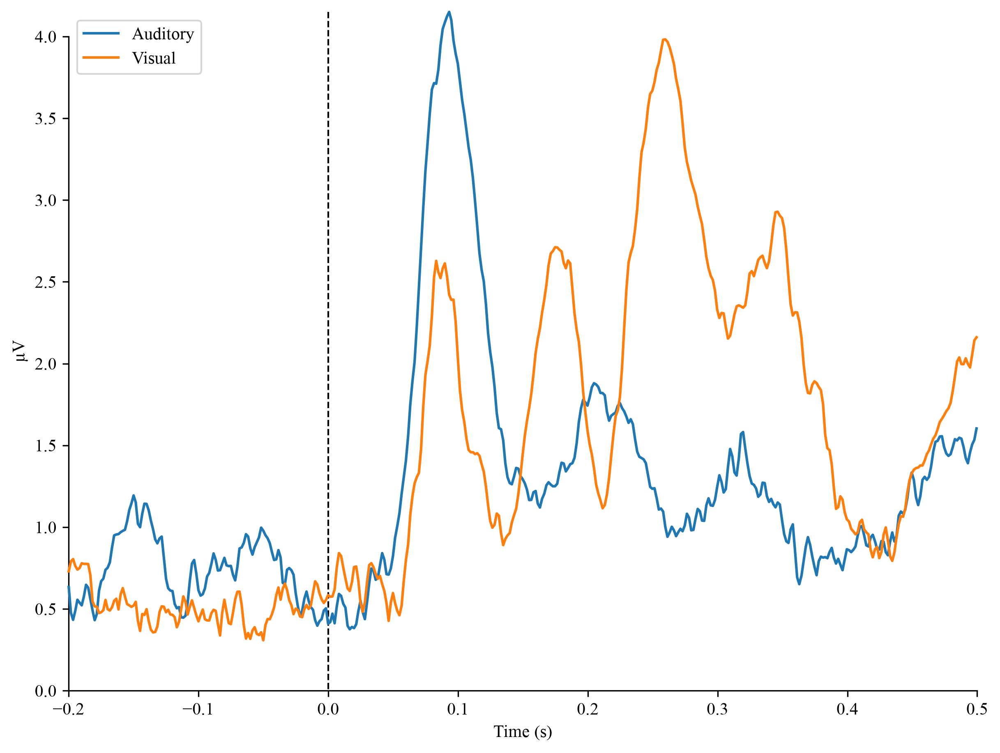
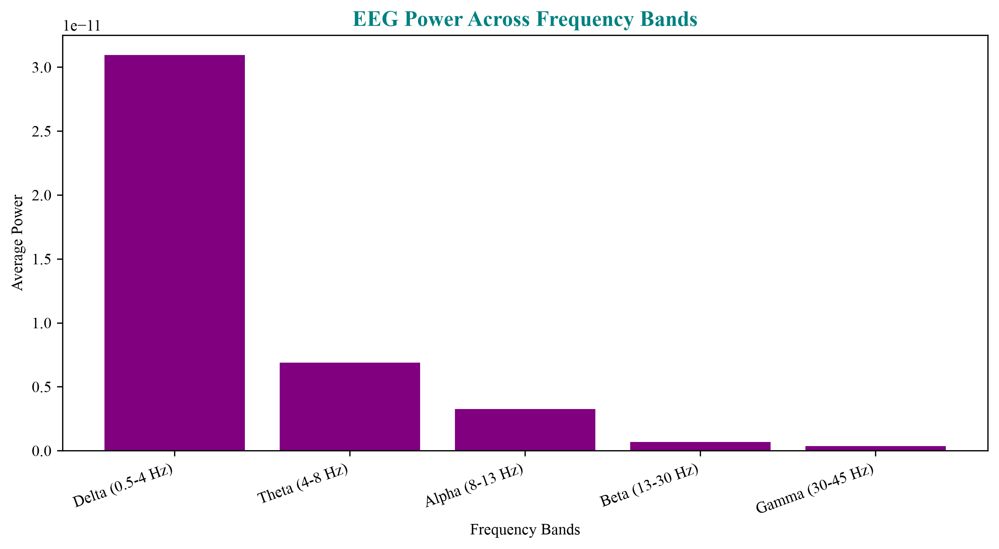

# EEG Signal Analysis with MNE-Python
A hands-on series of EEG analyses as I learn the fundamentals of neurotechnology!

---

## Project 1: Frequency Analysis (Power Spectral Density)

My first neurotechnology project: loading, filtering, and analyzing real EEG data.

### What I did
- Loaded a real EEG/MEG sample dataset using MNE-Python
- Selected the EEG channels from the recording
- Applied a 1-40 Hz bandpass filter to remove slow drift and high-frequency noise, keeping the frequency range where meaningful brain activity occurs
- Computed and plotted the power spectral density (PSD) to see how much of each frequency is present in the signal

### What I found
- A peak around 8–12 Hz, consistent with the brain's alpha rhythm
- A clear drop-off at 40 Hz, showing the effect of the bandpass filter

### The tools I used
Python, MNE-Python, Matplotlib, NumPy

### New Skills I learned
Loading EEG data, filtering, and frequency (PSD) analysis

---

## Project 2: Event Related Potentials (ERP)

As I build on the frequency analysis above, this project looks at how the brain
responds to specific events - sounds and images shown during the recording.

### What I did
- I found every moment a stimulus occurred (auditory or visual) from the event markers in the recording
- Cut the continuous EEG into short windows (epochs) around each event, from 0.2s before to 0.5s after
- Averaged together all epochs of the same type. Since random noise differs on every trial but the brain's actual responses are consistent, averaging cancels the noise and reveals the real response: the Event Related Potential (ERP)
- Compared the averaged auditory response against the averaged visual response

### What I found
- Both responses rise sharply after the stimulus (at time 0), while the pre-stimulus baseline stays flat. This shows the brain clearly reacting to the events
- I noticed that the auditory response peaks earlier (~0.1s), while the visual response peaks later (~0.25s), reflecting that auditory and visual information are processed on different timescales in the brain 

### New skills I learned
Event handling, epoching, averaging to compute ERPs, and comparing conditions.

---

## Project 3: Frequency Band Power Analysis

For this project, I learnt to divide the EEG signal into the five classic brain wave bands and measure how much power is in each.

### What I did
- I computed the power spectral density and extracted the underlying numbers (power at each frequency, for each channel)
- Defined the five standard EEG frequency bands: Delta (0.5–4 Hz), Theta (4–8 Hz), Alpha (8–13 Hz), Beta (13–30 Hz), and Gamma (30–45 Hz)
- For each band, I selected the frequencies that fall inside it and averaged their power across all channels to get a single band-power value
- To visualize it clearly, I graphed the result as a bar chart comparing power across the bands

### What I found
- I saw that low-frequency Delta band has the highest power. Power steadily decreases toward the higher bands (Gamma), reflecting the "1/f" pattern seen in EEG.
- I thought that because raw power is heavily weighted toward the slow waves, a natural next step would be computing relative band power, which makes for a fairer comparison across bands

### New skills added
Extracting numerical data from a spectrum, isolating frequency bands, computing band power, and interpreting the 1/f structure of EEG.

